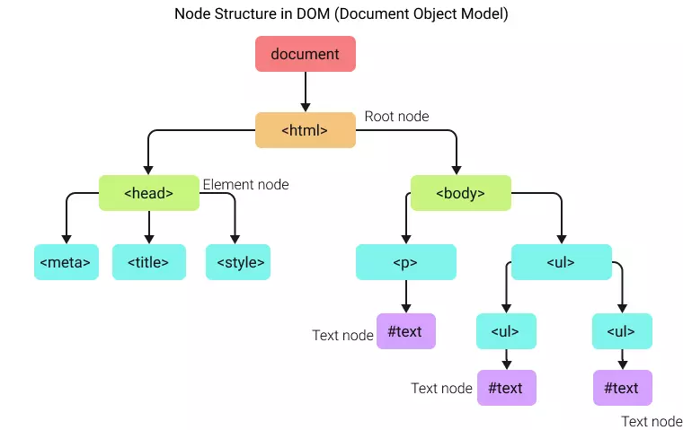

# Optimize

## Node in javascript

- A node is a part of the DOM tree that is used to get access to every component of a webpage.
- Cây DOM là cây gồm các nút được trình duyệt tạo khi trang được tải. Cây là sự thể hiện của tài liệu HTML. All parts of this tree such as the head, body, another HTML tag, text, attributes, etc. are known as nodes.



- In the above picture, you can see that at the end of every branch, there lies a node, either an element node or text node. But even there are other things like comment, attribute, CDATA, etc all come under the node category.

> Every node is an object which has multiple methods and properties, commonly nodes are also called `node objects`.

**Note**: Every HTML element is a node in javascript but every node (TextNode, AttributeNode, NamespaceNode) is NOT an HTML element.

### TextNode:

- `TextNode` là một loại Node trong DOM được sử dụng để biểu diễn văn bản nằm giữa các thẻ trong một trang web. - Ví dụ, trong mã HTML <p>Hello, <strong>world</strong>!</p>, có hai TextNode: một cho "Hello, " và một cho "!".
  AttributeNode:

- `AttributeNode` là một loại Node biểu diễn một thuộc tính của một phần tử HTML. - Ví dụ, nếu có một thẻ  như sau: , thì mỗi thuộc tính (src và alt) sẽ được biểu diễn bởi một AttributeNode.
  NamespaceNode:

- `NamespaceNode` là một loại Node thể hiện không gian tên trong XML hoặc XHTML.
  - Trong môi trường HTML thông thường, không gian tên ít khi được sử dụng. Tuy nhiên, nó quan trọng trong các ngữ cảnh sử dụng XML và XHTML.

```js
var paragraphElement = document.querySelector("p");

var childNodes = paragraphElement.childNodes;

for (var i = 0; i < childNodes.length; i++) {
  if (childNodes[i].nodeType === Node.TEXT_NODE) {
    console.log("TextNode:", childNodes[i].nodeValue);
  }
}

// Result: "Hello, " và "!".
```

## Types of nodes in javascript

| Type               |                                               Description                                                | Type Value |
| ------------------ | :------------------------------------------------------------------------------------------------------: | ----: |
| Element node       |                        Example of element nodes are `<p>`, ``, `<div>`, etc                         |     1 |
| Attribute node     |                        Example of element nodes are `class`, `title`, `src`, etc                         |     3 |
| Text node          |      The actual text inside an element are called text node. Example `<p>This is a text node.</p>`       |     8 |
| Comment node       |            All the HTML comments are comment node. Example `<-- This is an HTML comment -->`             |     9 |
| Document node      |                            The document is itself a node. Example `document`                             |     1 |
| Document type node | The document type defined at the top of document is called document type node. Example `<!DOCTYPE html>` |    10 |
| CDATA Section node |                                 Example of CDATA is `<![CDATA[ ... ]]>`                                  |     4 |

```js
<p id="para">This is a paragraph.</p>

// selecting node
let p = document.getElementById("para");
// get node name and node type
console.log(p.nodeName, p.nodeType); // P, 1
// get node name and node type of child node
console.log(p.firstChild.nodeName, p.firstChild.nodeType); // #text, 3
// get node name and node type of next sibling
console.log(p.nextElementSibling.nodeName, p.nextElementSibling.nodeType); // SCRIPT, 1
```

The global node is used to get to all other nodes in the `document` node.

> The `document` node is the root node of the document. It has a nodeType = 9 and a nodeName = #document.

## References

- Optimize: <https://www.tutorialstonight.com/what-is-a-node-in-javascript>
