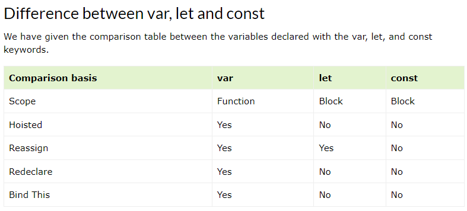

# Hoisting

## Temporal Dead Zone (TDZ)

Trong JavaScript, khi một biến được khai báo bằng `let` hoặc `const`, biến đó sẽ tồn tại trong phạm vi của block mà nó được khai báo. Tuy nhiên, trước khi biến đó được khai báo, chúng sẽ rơi vào ``Temporal Dead Zone (TDZ)``, nghĩa là không thể truy cập hoặc sử dụng biến đó trước khi nó được khai báo. Khi bạn cố gắng truy cập biến trong TDZ, JavaScript sẽ ném một lỗi ReferenceError. Điều này giúp tránh các lỗi logic do sử dụng biến trước khi nó được khai báo đúng cách.

## Hoisting với var

```js
console.log(age); // undefined - biến age sẽ được đưa lên trên dòng 1 (var age) do chưa khai báo nên nó có giá trị mặc định in ra undefined
console.log(fullName); // ReferenceError: fullName is not defined
var age = 16;
```

## Hoisting với let, const

> Khai báo với let & const vẫn được hoisting nhưng không được gán giá trị mặc định là undefined như var nên sinh ra lỗi
> Nó được đưa vào **"Temporal dead zone"** (vùng tạm thời ko truy cập được, vùng tạm thời ko sử dụng được)

```js
console.log(fullName); // Uncaught ReferenceError: Cannot access 'fullName' before initialization
let fullName = "Sơn Nguyễn";
```

## Hoisting với function declaration

```js
console.log(sum(6, 9)); // 15

function sum(a, b) {
  return a + b;
}
```

## Hoisting với Closure

```js
const couter1 = makeCouter();
console.log(couter1()); // 1
console.log(couter1()); // 2
console.log(couter1()); // 3

// closure
function makeCouter() {
  let couter = 0;
  return increase;

  // được hoisting :))
  function increase() {
    return ++couter;
  }
}
```

