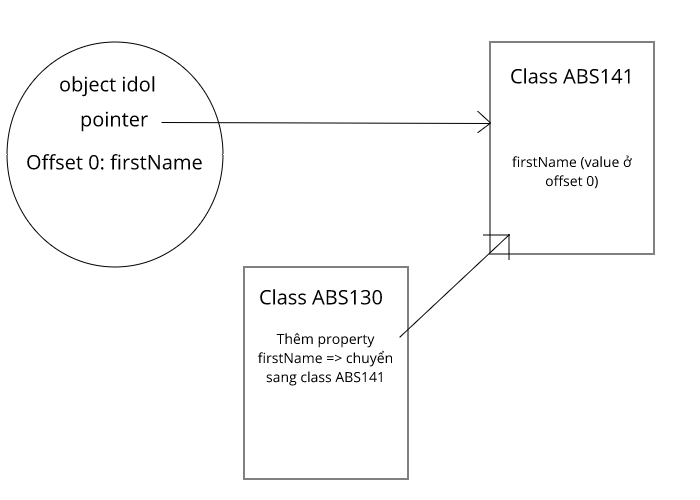

# Cách thức hoạt động của JavaScript: V8 engine và 5 mẹo tối ưu hóa

## Tổng quan

Một `JavaScript engine` là một chương trình hoặc trình thông dịch thực thi mã Javascript.

Một Javascript engine có thể thông dịch như thường, hoặc biên dịch just-in-time từ Javascript thành bytecode 

Đây là danh sách các dự án phổ biến đang triển khai JavaScript engine:

- **V8**: mã nguồn mở, được phát triển bởi Google, viết bằng C ++
- **JavaScriptCore**: mã nguồn mở, được biết đến là Nitro và do Apple phát triển cho Safari
- **Chakra** (JScript9): Internet Explorer
- **Chakra** (JavaScript): Microsoft Edge
- **JerryScript**: Là một công cụ nhẹ cho Internet of Things.

## Tại sao V8 Engine được tạo ra?

- V8 Engine được xây dựng bởi Google là mã nguồn mở và được viết bằng C ++.
- Công cụ này được sử dụng trong Google Chrome.
- Tuy nhiên, khác với phần còn lại của engine, V8 cũng được sử dụng phổ biến cho Node.js.

V8 lần đầu tiên được thiết kế để tăng hiệu suất việc thực hiện JavaScript bên trong các trình duyệt web. Để tối ưu hóa tốc độ, V8 chuyển code JavaScript thành machine code thay vì sử dụng một interpreter. Nó biên dịch code JavaScript thành machine code bằng cách sử dụng trình biên dịch JIT (Just-In-Time) như rất nhiều công cụ JavaScript hiện đại như SpiderMonkey hay Rhino (Mozilla). 

> Sự khác biệt chính ở đây là V8 không tạo ra code bytecode hoặc bất kỳ code trung gian nào.

## Fast Property Access

### Hidden Class

Đa số các Javascript engine đều sử dụng cấu trúc dữ liệu dạng dictionary-like, mỗi lần truy cập các property thì phải cần một dynamic lookup để solve vị trí của property này trong bộ nhớ.

Cách này làm cho việc truy cập vào property của Javascript chậm hơn kha khá so với truy cập vào instance variable như Java: *instance variable đặt ở các fixed offset*, được xác định bởi compiler nhờ việc bố trí fixed object layout và định nghĩa bởi class chứa object đó, vì vậy để truy cập vào property thì thường chỉ cần 1 hoặc vài lệnh và cũng chỉ là vấn đề của memory load.


Để giải quyết điều này, V8 sẽ tự động tạo các hidden class (class ẩn), khi một property được thêm vào object, một hidden class sẽ được tạo ra (nhiều ông developer trong và ngoài nước vẫn thường nghĩ là tạo hash table).

```js
function idol(firstName, lastName) {
  this.firstName = firstName;
  this.lastName = lastName;
}

const name = new idol('Takizawa', 'Laura'); 
```

Khi idol() được gọi thì một hidden class sẽ được tạo, chẳng hạn ta gọi class là ABS130 chẳng hạn, thì field đầu tiên của Object idol trên là tham chiếu đến class `ABS130`. 


Ban đầu, class ABS130 là một class rỗng, khi this.firstName = firstName được gọi, một hidden class nữa sẽ được tạo, ta gọi class này là `ABS141` chẳng hạn, class ABS141 sẽ giữ một tham chiếu đến class ABS130 (tức là class trước đó), class ABS141 sẽ có một property là firstName , value của nó được lưu tại `offset 0`, còn pointer sẽ cập nhật đến class mới là class ABS141.



Tương tự với this.lastName = lastName, ta gọi class mới là MAS087:


Mặc dù nhìn có vẻ khá lằng nhằng, nhưng cách này khá hiệu quả vì khi tạo mới object idol trong các lần tiếp theo, nếu có cùng property và thứ tự giống nhau thì sẽ có cùng các hidden class vì tất cả các hidden class đều có thể tái sử dụng, còn nếu có khác nhau vài property thì V8 sẽ tạo thêm các branch (nhánh) riêng, ví dụ:


### Inline cache

- Đây là một kỹ thuật tối ưu hóa khá phổ biến và cũng khá lâu đời, phát triển lần đầu cho Smalltalk và khá hữu dụng cho mấy ngôn ngữ động. 
  + Inline cache (bộ nhớ đệm) sẽ quan sát các method được gọi được lặp lại có xu hướng xảy ra trên cùng 1 kiểu object. 
  + Khi method được gọi, nó sẽ cache lại kiểu của object vừa được truyền vào, và dùng nó làm giả thiết cho tham số truyền vào trong lần gọi tiếp theo. Nếu như giống nhau, nó sẽ trực tiếp trỏ đến đó và bỏ qua quá trình truy cập lằng nhằng để tìm đến property.


## Dynamic Machine Code Generation (Tạo mã máy động)

Trong một project, khi code thì chắc chắn sẽ có kha khá các object có cùng hidden class, việc dùng hidden class để access vào property của object đó với sự hỗ trợ của inline cache và machine code sẽ cải thiện tốc độ khá lớn đối với các object cùng kiểu và cùng cách truy cập.

Khi access vào property của object, V8 sẽ cache lại hidden class đó. Trong quá trình này, V8 tối ưu hóa bằng cách lấy hidden class để dự đoán cho các lần access tiếp theo, và sẽ lấy thông tin của hidden class đó patch inline cache code để sử dụng hidden class. Nếu đoán đúng thì value của property sẽ được gán, còn sai thì sẽ remove đoạn đó đi.

Chẳng hạn ta đang access vào property firstName của object idol:

```js
idol.firstName
```

Thì machine code sẽ được generate ra thế này:

```
# ebx = idol object
cmp [ebx,<hidden class offset>],<cached hidden class>
jne <inline cache miss>
mov eax,[ebx, <cached x offset>]
```

Nếu như hidden class chứa object idol không trùng với hidden class được cache từ trước, V8 runtime sẽ xử lí inline cache misses và patch lại inline cache code. Còn nếu trùng thì chỉ cần lấy property firstNameđã được cache ra là xong.

## Tổng quan

### Ignition và TurboFan
- Ignition và TurboFan ra đời để tối ưu hóa tốc độ cũng như thay thế những thiếu sót của 2 người tiền nhiệm là Full-codegen và Crankshaft.
  + TurboFan được thiết kế như là một compiler cho phép tách biệt giữa tối ưu hóa compiler cấp cao và cấp thấp, khiến cho việc thêm các tính năng mới vào Javascript mà không cần phải sửa đổi mã kiến trúc
  + Còn với Ignition, nhìn chung lí do mà nó ra đời chính là do việc giảm bộ nhớ tiêu thụ trên điện thoại.

> Sử dụng Ignition, V8 sẽ thông dịch code thành bytecode, bộ nhớ cấp phát của nó chỉ khoảng một nửa so với cách ở trên. **Sau đó V8 tận dụng bytecode có được để TurboFan generate trực tiếp ra machine code thay vì phải biên dịch lại từ mã nguồn như Crankshaft đã làm.**


### V8 Bytecode

Khi V8 biên dịch mã JavaScript, trình phân tích cú pháp (parsers) sẽ generate một cây cú pháp trừu tượng (abstract syntax tree). Ignition sẽ generate bytecode từ syntax tree. TurboFan sẽ lấy mã bytecode và generate machine code tối ưu từ nó.


Dịch bytecode về machine code sẽ đơn giản hơn nếu bytecode được thiết kế cùng mô hình như CPU (mỗi dòng CPU có một tập lệnh riêng).

